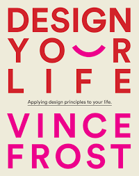

### EX NO: 07

# <p align="center">Create a Web-Layout using Grid BOX</P>

## Aim:
The aim of the project is to create a web-layout using Grid BOX

## Algorithm:

Step 1: Create the HTML structure

Step 2: Define the grid layout in CSS

Step 3: Define the grid columns and rows

Step 4: Place grid items within the grid

Step 5: Style the grid items
  
Step 6: Preview the web layout


## Program

### index.html
```html
<!DOCTYPE html>
<html lang="en">
<head>
    <meta charset="UTF-8">
    <meta http-equiv="X-UA-Compatible" content="IE=edge">
    <meta name="viewport" content="width=device-width, initial-scale=1.0">
    <title>Grid Layout</title>
    <link rel="stylesheet" href="assets/css/style.css">
</head>
<body>
      <div class="grid-container">
        <div class="item1">
            <div class="nav">
            <li>The Book</li>
            <li>Author</li>
            <li>Press</li>
            <li>Events</li>
            <li>Shop</li>
            <li>Contact</li>
            </div>
        </div> 
        <div class="item2"></div>
        <div class="item3">
            <p><u>Upcoming Podcasts</u></p><br><br>
            <h3>Deborah Bibby</h3>
        </div>  
        <div class="item4">
            <p><u>The Book</u></p><br>
            
        </div>
        <div class="item5">
            
        </div>
        <div class="item6">
            <p><u>Synopsis</u></p><br>
            <h3>Applying design<br>principles to your<br>life.</h3>
        </div>
        <div class="item7">
            <p><u>Author</u></p>
            <h3>Vince Frost*</h3>
        </div>
        <div class="item8">
            
        </div> 
        <div  class="item9">
            <br>
            <h3>Shop</h3>
        </div> 
        <div  class="item10">
            <p>Designing Wellbeing with Kerry Hill Architects</p>
        </div> 
        <div  class="item11">
            <h3>View the latest events</h3>
        </div>
      </div>

</body>
</html>


```

### style.css
```css
*{
    margin: 0;
}

img{
  width: 100%;
}
.grid-container {
    display: grid;
    grid-template-columns: auto auto auto;
    gap: 10px;
    background-color: black;
    padding: 10px;
  }
  
  .grid-container > div {
    background-color: white;
    text-align: center;
    padding: 0;
    font-size: 30px;
  }
  
  .item1 {
    grid-row-start: 1;
    grid-row-end: 1;
    grid-column-start: 1;
    grid-column-end:10;
  }

  li{
    list-style-type: none;
    padding-right: 20px;

}

.nav{
    display: flex;
    flex-direction: row;
}

.item2 {
  grid-row-start: 2;
  grid-row-end: 4;
  grid-column-start: 1;
  grid-column-end: 1;
}

.item3 {
  text-align: center;
  grid-row-start: 2;
  grid-row-end: 4;
  grid-column-start: 2;
  grid-column-end: 2;
}

.item3 p{
  font-size: 20px;
}

.item4 {
  text-align: center;
  grid-row-start: 2;
  grid-row-end: 6;
  grid-column-start: 3;
  grid-column-end: 10;
}

.item4 p{
  font-size: 20px;
}

.item5 {
  grid-row-start: 4;
  grid-row-end: 9;
  grid-column-start: 1;
  grid-column-end: 3;
  background-color: black;
}


    
.item6 {
  grid-row-start: 6;
  grid-row-end: 9;
  grid-column-start: 3;
  grid-column-end: 4;
}

.item7 {
    grid-row-start: 6;
    grid-row-end: 8;
    grid-column-start: 4;
    grid-column-end: 10;
  }
  
  .item8 {
    grid-row-start: 8;
    grid-row-end: 9;
    grid-column-start: 4;
    grid-column-end: 7;
  }
  .item9 {
    grid-row-start: 8;
    grid-row-end: 9;
    grid-column-start: 7;
    grid-column-end: 10;
  }

  .item10{
    grid-row-start: 9;
    grid-row-end: 10;
    grid-column-start: 1;
    grid-column-end: 3;
  }

  .item11{
    grid-row-start: 9;
    grid-row-end: 10;
    grid-column-start: 3;
    grid-column-end: 10;
  }


```

## Output


## Result
The Grid-Box concept is implemented and verified.
